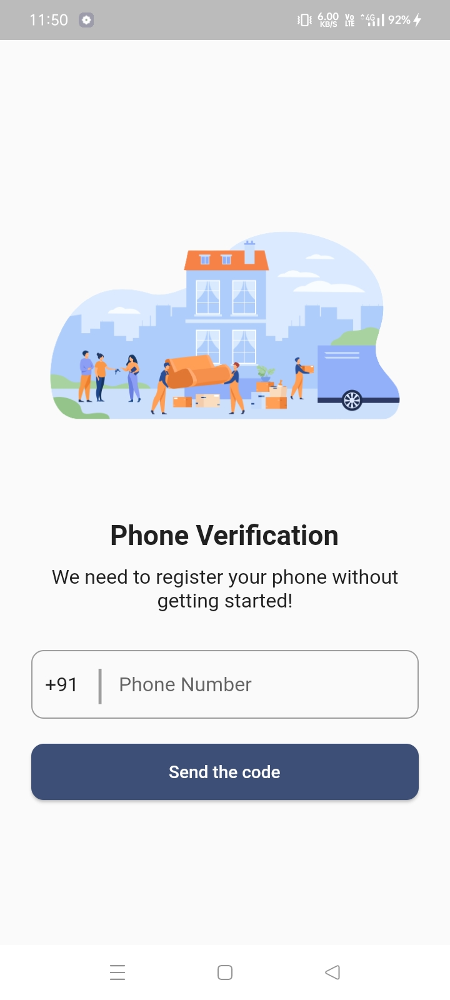
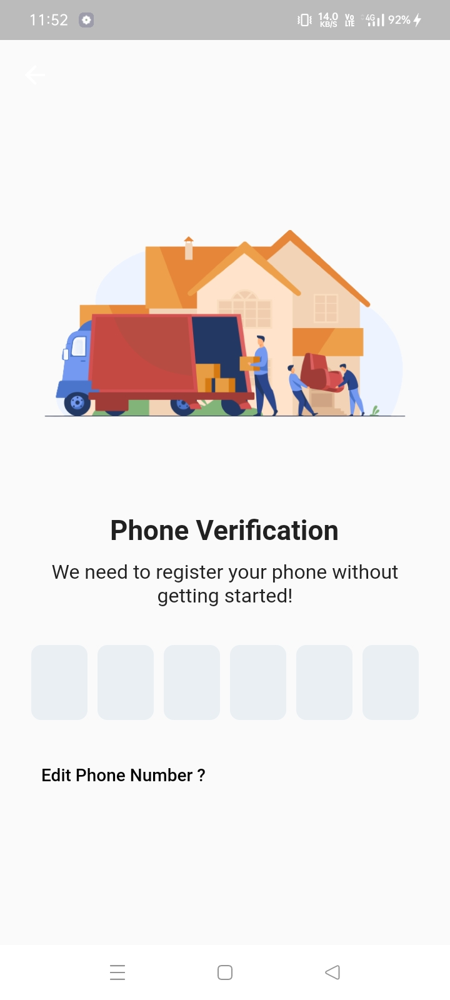
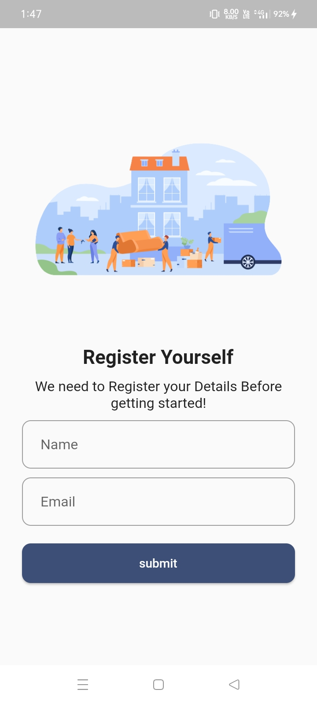
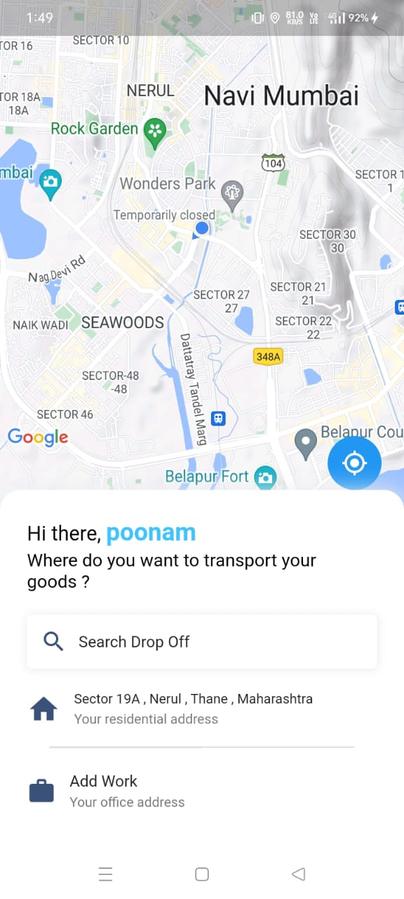
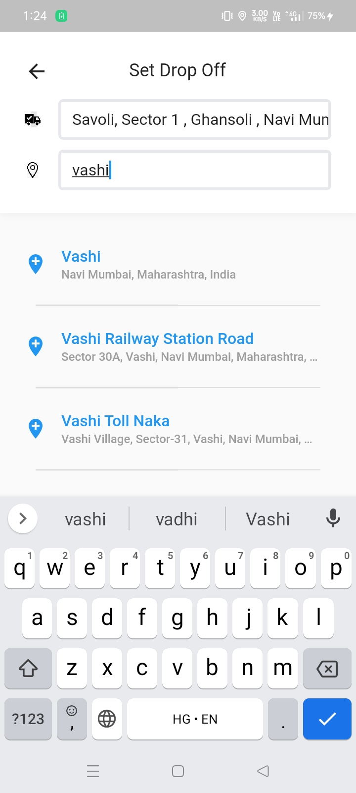
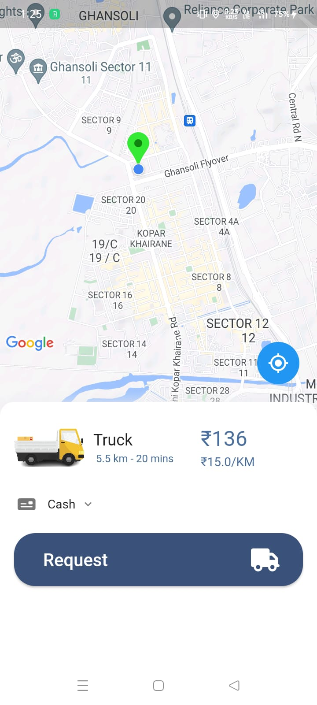

 
<h1 align="center">
Ondoorstep
</h1>

Packers and Movers

## Getting Started

This project is a starting point for a Flutter application.

A few resources to get you started if this is your first Flutter project:

- [Lab: Write your first Flutter app](https://docs.flutter.dev/get-started/codelab)
- [Cookbook: Useful Flutter samples](https://docs.flutter.dev/cookbook)

For help getting started with Flutter development, view the
[online documentation](https://docs.flutter.dev/), which offers tutorials,
samples, guidance on mobile development, and a full API reference.

## Introduction
Ondoorstep is an Application which provide an interactive 
platform between users and packers and Movers Company. Users can book the services 
through this Application. we do not have to maintain everything manually. Through this App
if any enquiry occurs it is corresponding entries is done automatically because database 
management system gives facility of having relationship between the tables. In proposed 
system we do not have to maintain record manually.

## Screenshots
                     

           

## Thanks to Contributor

If you liked this project, please leave a 🌟

